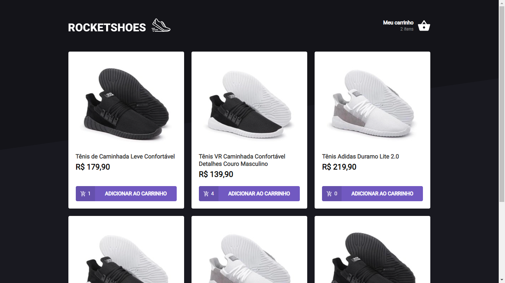
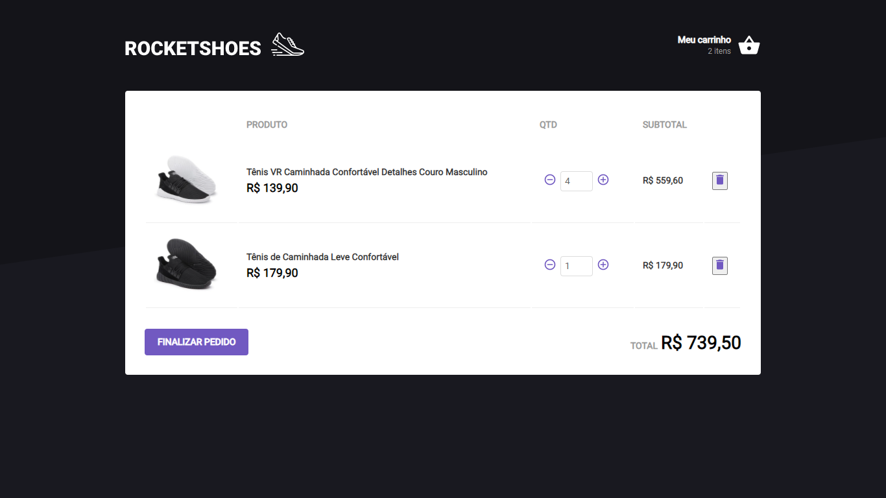

## ROCKETSHOES:

<h1 align="center">
    
</h1>


<h4 align="center">
  In this project, the idea was to show in practice the knowledge of ReactJs by reproducing an ecomerce of hunts, with an interactive interface.
</h4>

<p align="center">
  <a href="#rocket-technologies">Technologies</a>&nbsp;&nbsp;&nbsp;|&nbsp;&nbsp;&nbsp;
  <a href="#information_source-how-to-use">How To Use</a>&nbsp;&nbsp;&nbsp;|&nbsp;&nbsp;&nbsp;
  <a href="#sunny-result">Result</a>
</p>


## :rocket: Technologies and Tools

This project was developed with the following technologies:

- [ReactJS](https://reactjs.org/)
- [Redux | Redux Saga](https:///)
- [Class Componetns](https://pt-br.reactjs.org/docs/react-component.html)
- [react-icons](https://react-icons.github.io/react-icons/)
- [Axios](https://reactjs.org/)
- [Json-server](https://reactjs.org/)
- [immer](https://reactjs.org/)


## :information_source: How To Use

To clone and run this application, you'll need [Git](https://git-scm.com), [Node.js v12.18.4][nodejs] or higher + [Yarn v1.22][yarn] or higher installed on your computer. From your command line:

```bash
# Clone this repository
$ git clone https://github.com/Ivo-Jr/rocketshoes.git

# Go into the repository
$ cd rocketshoes

# Install dependencies
$ yarn or npm install

# Run the json-server
$ yarn json-server server.json -p 3333

# Run the app
$ yarn or npm start
```

## :sunny: Result

  <div style="display: flex;   flex-direction: column;
  align-items: center;">
  <h1 align="center" style="display: flex; flex-direction:row;">
      
       <br>
       <br>
      
      <br>
  </h1>     
  </div>

---

Made with ♥ by Ivo Junior :wave: <a href="https://www.linkedin.com/in/jos%C3%A9-ivo-maciel-j%C3%BAnior-658136145/" target="_blank">[Get in touch!]</a>

[yarn]: https://yarnpkg.com/
[vc]: https://code.visualstudio.com/

----